# Clinica OnLine (Javier Francia)

Nuestra WebApp es un sistema de gestión de turnos y usuarios enfocado a la atención médica. Con ella, se pueden organizar los turnos para consultas, las jornadas laborales de los profesionales y los datos recolectados de cada consulta, entre otras posibilidades.
A continuación se detallan las funcionalidades y una breve guía de cómo acceder a ellas, separadas por perfil de usuario.

---

## Testeo
Para facilitar el testeo de la WebApp se proveen perfiles ya cargados y con operaciones tanto finalizadas como en curso. Para acceder a estos perfiles se debe presionar Ctrl + Alt + . (punto), en ese momento aparece una pantalla con un listado de botones que, al presionarlos, setean los usuarios y contraseñas para ingresar al sistema, y también deshabilitan el captcha, para poder ingresar con más facilidad.

---

## Todos los perfiles

#### Inicio de sesión

La primera pantalla que aparece es la de inicio de sesión. En esta pantalla se completan los datos para ingresar al sistema o, si no se tiene un usuario, se puede hacer clic en el botón “Registrarse” para generar una nueva cuenta.

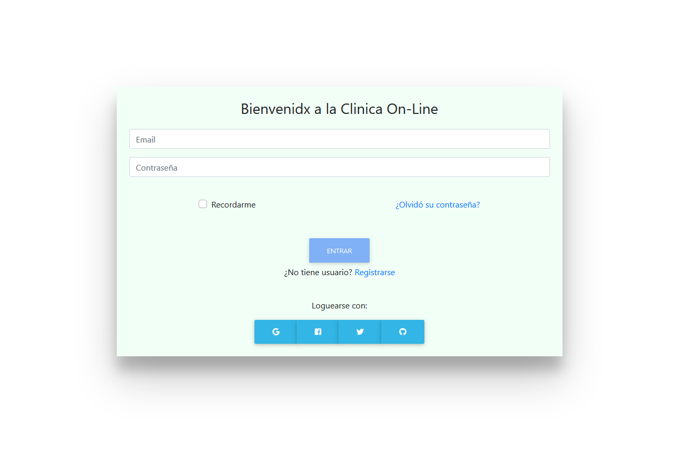

#### Registro

En esta pantalla se generan los usuarios para los pacientes y los profesionales, simplemente completando los datos e indicando el tipo de usuario que se desea generar. Al registrarse va a llegar un correo al email brindado, para poder validar que la dirección sea correcta.

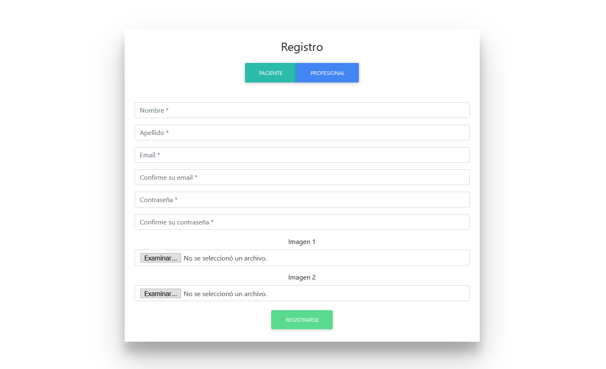

#### Home
Es la pantalla principal. En esta pantalla aparecerán novedades de la clínica y una barra de navegación que nos permite ingresar a las distintas pantallas del sistema. Cada tipo de perfil tiene sus propias pantallas.
Si un paciente todavía no validó su email o un profesional no está habilitado por un administrador, no podrán navegar hacia las otras pantallas del sistema.

Así es como se ve la pantalla cuando tiene acceso:

Así es como se ve la pantalla cuando NO tiene acceso (en este caso por falta de validación del email):

#### Salir
Es el botón que permite cerrar sesión.
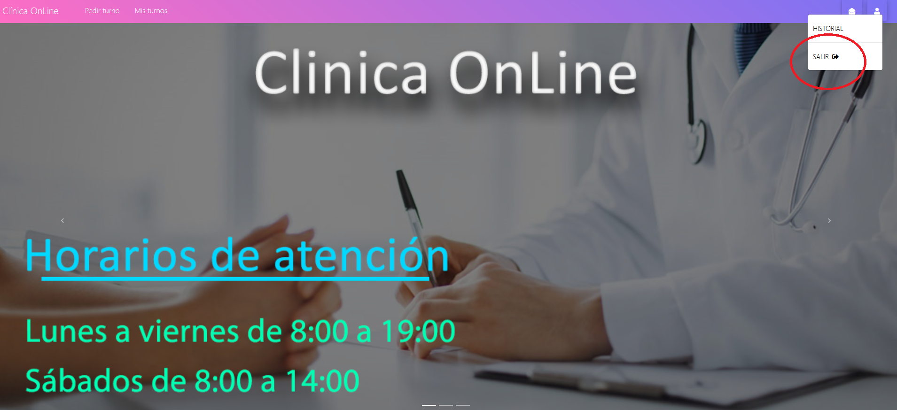

---

## Administrador
Es quien tiene permisos para habilitar a un profesional a que use la WebApp y quien puede definir nuevas especialidades para que los profesionales seleccionen cuando se registran.

#### Habilitar a un profesional
Cuando un profesional se registra en el sistema, su usuario va a aparecer listado en esta pantalla. Se puede procesar la habilitación de la cuenta con el botón “Habilitar” que figura para ese usuario.

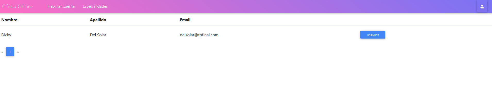

#### Agregar una especialidad
Para que un profesional pueda indicar su especialidad al registrarse, primero hay que cargarla en esta pantalla. En ella se muestra un listado de las especialidades existentes en el sistema y se brinda el botón “Cargar nueva especialidad” para agregar una nueva.

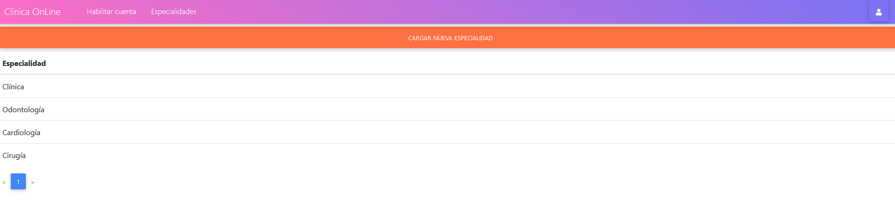

---

## Profesional
El profesional puede definir sus jornadas laborales, agregar información asociada al turno de un paciente, ver las encuestas que completan los pacientes atendidos, ver su historial de turnos, aceptar, rechazar o cancelar un turno y buscar información ya cargada en turnos anteriores.

#### Atender paciente
En esta pantalla se hace efectiva la atención brindada al paciente. En ella aparecen todos los turnos con estado “Confirmado”, o sea, que ya fueron aceptados por el profesional, y al hacer clic en el botón “Atender paciente” se brinda un formulario para completar con todos los datos recolectados en la consulta. Al confirmar este proceso, el turno pasa a estado “Finalizado”.

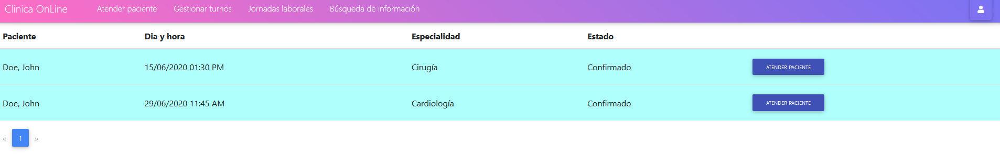
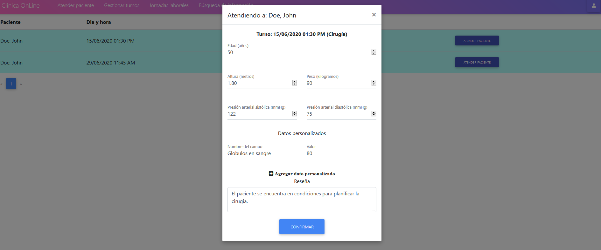

#### Gestionar turnos
En esta pantalla se pueden aceptar, rechazar o cancelar turnos, mediante botones que aparecen en el listado de turnos.

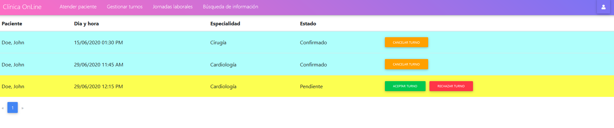

#### Jornadas laborales
En esta pantalla se definen los días y horarios que trabaja el profesional, la duración de los turnos y la especialidad con la que trabaja ese dia. Se puede registrar un esquema por dia y es lo que permite a los pacientes ver en que momento pueden ser atendidos por el profesional.

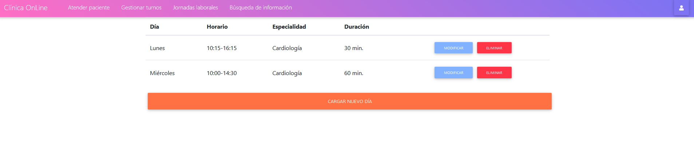

#### Búsqueda de información
En esta pantalla el profesional puede ver tanto los detalles y las reseñas de un turno, como los datos del paciente recolectados durante la consulta. En la barra de búsqueda se puede especificar cualquiera de estos parámetros, como también el dia de la consulta, el nombre del paciente y el dia de la semana.

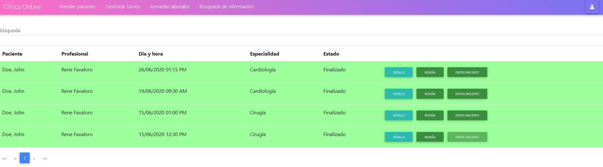

#### Historial
En esta pantalla el profesional puede ver su historial de turnos. Los turnos que figuran en este listado son los que tienen estado “Finalizado”, “Cancelado” y “Rechazado”. En el caso de que el paciente haya completado la encuesta de satisfacción, podrá ser visualizada por el profesional haciendo clic en el botón “Ver encuesta”.

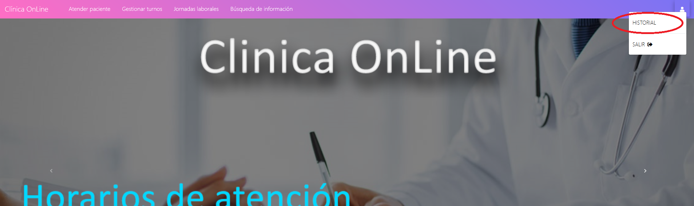
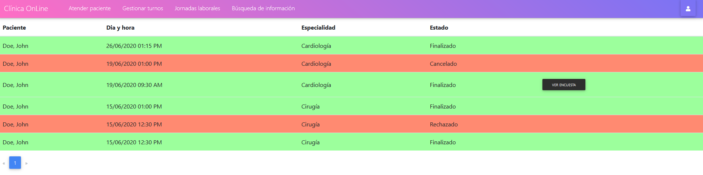

---

## Paciente
El paciente puede buscar los turnos disponibles y pedir uno, ver los turnos que pidió y su estado actual, ver el historial de sus consultas y recibir notificaciones.

#### Pedir turno
En esta pantalla el paciente puede listar los turnos disponibles, pudiendo especificar una búsqueda que coincida con el nombre del profesional, la especialidad o el dia de la semana. Al tener esa información puede elegir el turno que prefiera y pedir tomar ese turno. Estos turnos quedan con estado “Pendiente”, y requieren de ser aceptados por el profesional para confirmarse.

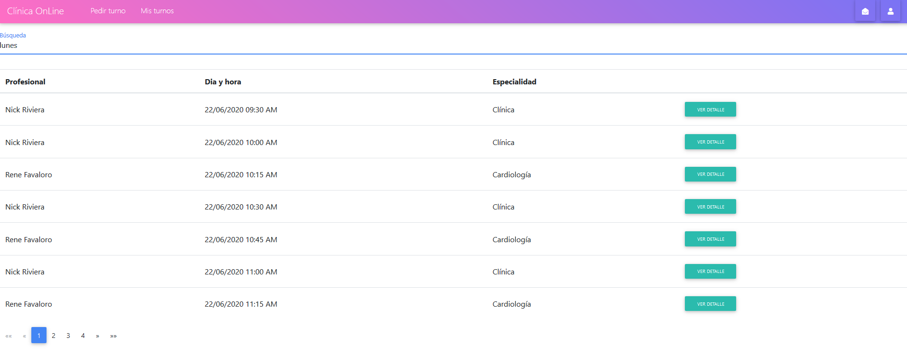
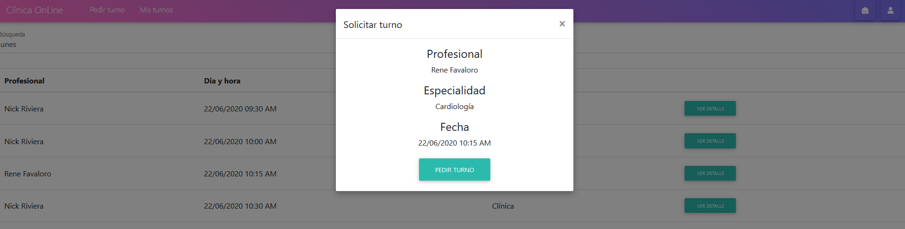

#### Mis turnos
En esta pantalla el paciente puede ver los turnos que tiene pendientes de confirmación o confirmados, pudiendo a su vez cancelarlos si asi lo desea.

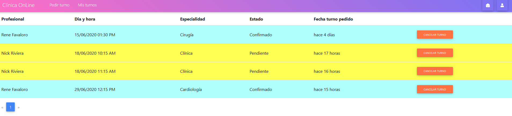

#### Notificaciones
En esta pantalla el paciente puede recibir una notificación cuando un profesional acepta, cancela o rechaza alguno de sus turnos.
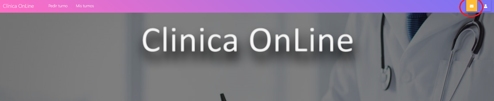
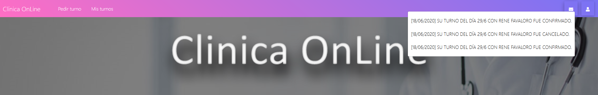

#### Historial
En esta pantalla el paciente puede ver su historial de turnos. Los turnos que figuran en este listado son los que tienen estado “Finalizado”, “Cancelado” y “Rechazado”.

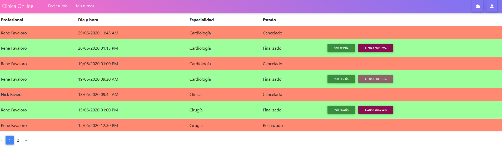
